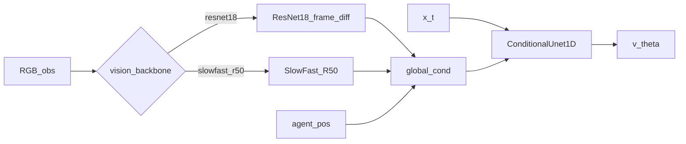

# Policies 架构说明

本文档说明 `va/robotfm/policies/` 目录下各模块的职责与数据流。

## 目录结构

- `encoders.py`：多相机图像（ImageNet 预训练 ResNet18 + 帧差）与状态 → `cond`
- `video_encoders.py`：SlowFast-R50 视频编码（与 ResNet **分文件**）→ `cond`
- `unet1d.py`：ConditionalUnet1D + FiLM 动作骨干
- `dit.py`：旧版 DiT（消融对照）
- `flow_matching.py`：OT-CFM 训练与 Euler 采样（可选 RTC 钩子）
- `a2a/`：A2A / N-A2A（torchcfm；obs_state / agent_pos → future actions）
- `rtc/`：Real-Time Chunking（`RTCConfig` / `RTCProcessor` / `ActionQueue`）
- `multitask_dit.py`：语言条件预留

## 总体思路

条件 Flow Matching 动作生成器，预测未来 `horizon` 步 action chunk。

视觉骨干由 `policy.vision_backbone` 选择：



训练路径：

```text
x_t = (1 - t) * x0 + t * x1
v*  = x1 - x0
v_theta(x_t, t, cond) ~= v*
```

推理路径（t: 0→1）：

```text
x <- noise
for t in Euler:
  v = unet(x, t, cond)
  if RTC: v = RTCProcessor.denoise_step(x, leftover, delay, t, v)
  x <- x + dt * v
```

## RTC 保真边界

- 完整移植 LeRobot：`denoise_step`、prefix schedules、`ActionQueue.merge`、debug `Tracker`
- 时间约定适配（非弱化）：robotfm / PI 原文 `t: 0→1`，`x1_hat = x_t + (1-t)*v`，`tau = t`；因 Euler `dt>0`，引导项为 `v + gw * correction`（对应 LeRobot `dt<0` 时的 `v - gw * correction`）
- 未移植：相对动作 reanchor、debug visualizer、异步 `RTCInferenceEngine`

## `encoders.py`（ResNet）

### `ResNet18Encoder`

- ImageNet 预训练，**保留 BatchNorm**
- ImageNet mean/std 归一化
- `use_frame_diff`：`[I0, I1-I0, ...]` 通道拼接，`conv1` 扩展到 `3 * n_obs_steps`
- SpatialSoftmax keypoints + GAP 外观 → 投影到 `out_dim`
- 输入：`(B, T, 3, H, W)`

### `MultiCameraEncoder`

- 每相机一次时序编码
- 状态 MLP 按时间步编码后拼接
- 配置：`pretrained_encoder`、`use_frame_diff`

## `video_encoders.py`（SlowFast）

### `SlowFastVideoEncoder`

- Torch Hub `slowfast_r50`（Kinetics 预训练），去掉分类头
- PackPathway（slow/fast，`alpha=4`）
- Kinetics mean/std → 时间维重采样到 32 → PackPathway → GAP 特征 → 投影到 `out_dim`
- 输入：`(B, T, 3, H, W)`（推荐 `T=8`，resize→crop 约 256/224；编码器内部升到 32 帧）

### `MultiCameraSlowFastEncoder`

- 与 `MultiCameraEncoder` 同形输出 `cond`
- **不**写入 `encoders.py`；日后 VideoMAE 等同接口新文件即可替换

## `unet1d.py`

ConditionalUnet1D + FiLM，默认 `down_dims=[256, 512, 1024]`。

## 训练配套

- 视觉参数组 lr = `train.lr * encoder_lr_scale`（默认 0.1）
- `max_grad_norm` 梯度裁剪
- ResNet：训练 RandomCrop(84) / 评估中心裁剪
- SlowFast：`resize_size`→`crop_size`（见 `configs/pusht_slowfast_fm.yaml`）
- 非 RTC：常用 `horizon == n_action_steps`
- RTC：需 `n_action_steps` / leftover overlap，且 `inference_delay < horizon`

## 张量形状

- `obs_images`: `(B, Cams, T_obs, 3, H, W)`
- `obs_state`: `(B, T_obs, state_dim)`
- `action`: `(B, horizon, action_dim)`
- `cond`: `(B, cond_dim)`
